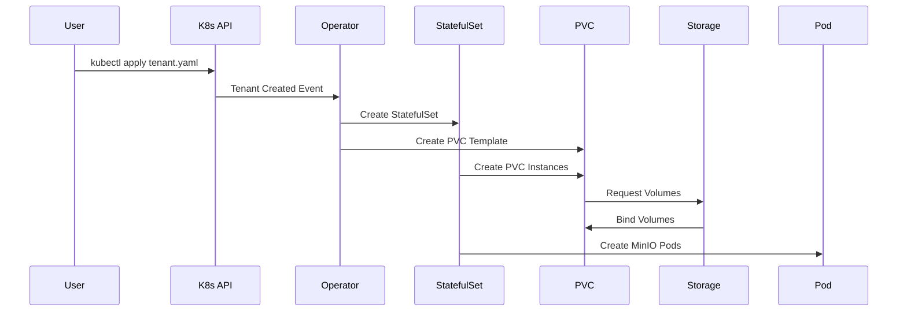

# Lab 1: MinIO Operator 설치 - 핵심 개념 완전 가이드

## 📚 개요

Lab 1에서는 공식 GitHub MinIO Operator v7.1.1을 설치하면서 현대적인 Kubernetes 네이티브 애플리케이션 관리의 핵심 개념을 학습합니다. Operator 패턴, CRD 기반 선언적 관리, 그리고 실제 프로덕션 환경에서의 운영 자동화를 이해합니다.

## 🏷️ 공식 MinIO Operator v7.1.1 정보

### 공식 릴리스 정보
- **GitHub 저장소**: https://github.com/minio/operator
- **최신 릴리스**: v7.1.1 (2025-04-23)
- **컨테이너 이미지**: minio/operator:v7.1.1
- **공식 설치**: `kubectl kustomize github.com/minio/operator\?ref=v7.1.1`

### 아키텍처 구성 요소
- **CRD API 버전**: minio.min.io/v2
- **사이드카 이미지**: quay.io/minio/operator-sidecar:v7.0.1
- **기본 MinIO 서버**: minio/minio:RELEASE.2025-04-08T15-41-24Z
- **지원 Kubernetes**: 1.20+

## 🔍 핵심 개념 1: Kubernetes Operator 패턴의 진화

### 전통적인 애플리케이션 관리의 한계

#### 수동 관리 방식의 문제점
```yaml
# 전통적인 방식: 개별 리소스 수동 관리
apiVersion: apps/v1
kind: Deployment
metadata:
  name: minio-server
spec:
  replicas: 4
  template:
    spec:
      containers:
      - name: minio
        image: minio/minio:RELEASE.2025-04-08T15-41-24Z
        # 수십 줄의 복잡한 설정...
---
apiVersion: v1
kind: Service
# 또 다른 수십 줄의 설정...
---
apiVersion: v1
kind: ConfigMap
# 또 다른 복잡한 설정...
```

**전통적인 방식의 한계**:
- ❌ **복잡성 폭발**: 수십 개의 YAML 파일 관리
- ❌ **운영 부담**: 업그레이드, 스케일링, 백업 등 모든 작업 수동
- ❌ **일관성 부족**: 환경별로 다른 설정과 절차
- ❌ **전문 지식 의존**: 각 구성 요소의 깊은 이해 필요
- ❌ **오류 가능성**: 수동 작업으로 인한 휴먼 에러

### MinIO Operator v7.1.1의 혁신적 접근

#### 선언적 관리의 힘
```yaml
# Operator 방식: 단일 리소스로 전체 시스템 정의
apiVersion: minio.min.io/v2
kind: Tenant
metadata:
  name: production-minio
  namespace: minio-tenant
  labels:
    app: minio
    environment: production
  annotations:
    prometheus.io/scrape: "true"
    prometheus.io/path: /minio/v2/metrics/cluster
    prometheus.io/port: "9000"
spec:
  # 고급 기능 설정 (v7.1.1)
  features:
    bucketDNS: true
    domains:
      minio: "minio.company.com"
      console: "console.company.com"
  
  # 자동 사용자 관리 (v7.1.1)
  users:
    - name: app-user
    - name: backup-user
  
  # 스토리지 풀 정의
  pools:
  - servers: 4
    name: pool-0
    volumesPerServer: 4
    volumeClaimTemplate:
      spec:
        accessModes: ["ReadWriteOnce"]
        resources:
          requests:
            storage: 100Gi
  
  # 운영 정책 (v7.1.1)
  podManagementPolicy: Parallel
  
  # 모니터링 통합 (v7.1.1)
  prometheusOperator: true
  
  # 라이프사이클 관리 (v7.1.1)
  lifecycle:
    postStart:
      exec:
        command: ["/bin/sh", "-c", "echo 'MinIO started'"]
```

**Operator 패턴의 혁신**:
- ✅ **선언적 관리**: "무엇을" 원하는지만 정의
- ✅ **자동 운영**: 설치, 업그레이드, 스케일링 자동화
- ✅ **도메인 지식 내장**: MinIO 전문가의 운영 노하우 코드화
- ✅ **일관성 보장**: 모든 환경에서 동일한 배포 및 관리
- ✅ **자가 치유**: 장애 발생 시 자동 복구

## 🔍 핵심 개념 2: MinIO Operator v7.1.1 아키텍처

### 전체 시스템 구조

```
┌─────────────────────────────────────────────────────────────┐
│                    Kubernetes Cluster                       │
│                                                             │
│  ┌─────────────────┐    ┌─────────────────┐                │
│  │  minio-operator │    │  minio-tenant   │                │
│  │   Namespace     │    │   Namespace     │                │
│  │                 │    │                 │                │
│  │ ┌─────────────┐ │    │ ┌─────────────┐ │                │
│  │ │ Operator    │ │───▶│ │   Tenant    │ │                │
│  │ │ Controller  │ │    │ │  Resource   │ │                │
│  │ │ v7.1.1      │ │    │ │    (CRD)    │ │                │
│  │ └─────────────┘ │    │ └─────────────┘ │                │
│  │                 │    │        │        │                │
│  │ ┌─────────────┐ │    │        ▼        │                │
│  │ │ STS Service │ │    │ ┌─────────────┐ │                │
│  │ │ (4223/TCP)  │ │    │ │ StatefulSet │ │                │
│  │ └─────────────┘ │    │ │ MinIO Pods  │ │                │
│  │                 │    │ └─────────────┘ │                │
│  │ ┌─────────────┐ │    │                 │                │
│  │ │ Operator    │ │    │ ┌─────────────┐ │                │
│  │ │ API Service │ │    │ │  Services   │ │                │
│  │ │ (4221/TCP)  │ │    │ │ & Ingress   │ │                │
│  │ └─────────────┘ │    │ └─────────────┘ │                │
│  └─────────────────┘    └─────────────────┘                │
└─────────────────────────────────────────────────────────────┘
```

### v7.1.1 핵심 구성 요소

#### 1. Operator Controller
```go
// v7.1.1 Controller의 핵심 로직 (의사코드)
type TenantController struct {
    client.Client
    Scheme *runtime.Scheme
    STSEnabled bool  // v7.1.1에서 기본 활성화
}

func (r *TenantController) Reconcile(ctx context.Context, req ctrl.Request) (ctrl.Result, error) {
    // 1. Tenant 리소스 조회
    tenant := &miniov2.Tenant{}
    if err := r.Get(ctx, req.NamespacedName, tenant); err != nil {
        return ctrl.Result{}, client.IgnoreNotFound(err)
    }
    
    // 2. v7.1.1 신규 기능 처리
    if err := r.handleFeatures(ctx, tenant); err != nil {
        return ctrl.Result{}, err
    }
    
    // 3. STS 정책 관리 (v7.1.1 강화)
    if r.STSEnabled {
        if err := r.reconcileSTSPolicies(ctx, tenant); err != nil {
            return ctrl.Result{}, err
        }
    }
    
    // 4. 사용자 자동 생성 (v7.1.1)
    if err := r.reconcileUsers(ctx, tenant); err != nil {
        return ctrl.Result{}, err
    }
    
    // 5. 모니터링 설정 (v7.1.1)
    if tenant.Spec.PrometheusOperator {
        if err := r.setupMonitoring(ctx, tenant); err != nil {
            return ctrl.Result{}, err
        }
    }
    
    // 6. 상태 조정
    return r.reconcileState(ctx, tenant)
}
```

**Controller의 역할**:
- **상태 감시**: Tenant 리소스 변경사항 실시간 감지
- **자동 조정**: 현재 상태를 원하는 상태로 지속적 조정
- **라이프사이클 관리**: 생성, 업데이트, 삭제 전체 과정 자동화
- **장애 복구**: 문제 발생 시 자동 복구 시도

#### 2. Custom Resource Definitions (CRDs)

**tenants.minio.min.io (v2 API)**
```yaml
apiVersion: apiextensions.k8s.io/v1
kind: CustomResourceDefinition
metadata:
  name: tenants.minio.min.io
spec:
  group: minio.min.io
  versions:
  - name: v2  # v7.1.1에서 사용하는 API 버전
    served: true
    storage: true
    schema:
      openAPIV3Schema:
        type: object
        properties:
          spec:
            type: object
            properties:
              # v7.1.1 신규 필드들
              features:
                type: object
                properties:
                  bucketDNS:
                    type: boolean
                  domains:
                    type: object
              users:
                type: array
                items:
                  type: object
                  properties:
                    name:
                      type: string
              prometheusOperator:
                type: boolean
              lifecycle:
                type: object
                properties:
                  postStart:
                    type: object
                  preStop:
                    type: object
```

**policybindings.sts.min.io (v7.1.1 신규)**
```yaml
apiVersion: apiextensions.k8s.io/v1
kind: CustomResourceDefinition
metadata:
  name: policybindings.sts.min.io
spec:
  group: sts.min.io
  versions:
  - name: v1alpha1
    served: true
    storage: true
    schema:
      openAPIV3Schema:
        type: object
        properties:
          spec:
            type: object
            properties:
              application:
                type: object
              policies:
                type: array
                items:
                  type: string
```

#### 3. 서비스 아키텍처

**Operator 서비스들**:
```yaml
# Operator API 서비스
apiVersion: v1
kind: Service
metadata:
  name: operator
  namespace: minio-operator
spec:
  ports:
  - port: 4221
    protocol: TCP
    targetPort: 4221
  selector:
    name: minio-operator

---
# STS 서비스 (v7.1.1에서 강화)
apiVersion: v1
kind: Service
metadata:
  name: sts
  namespace: minio-operator
spec:
  ports:
  - port: 4223
    protocol: TCP
    targetPort: 4223
  selector:
    name: minio-operator
```

## 🔍 핵심 개념 3: v7.1.1의 혁신적 기능들

### 1. 고급 기능 관리 (Features)

#### Bucket DNS 기능
```yaml
spec:
  features:
    bucketDNS: true
    domains:
      minio: "minio.company.com"
      console: "console.company.com"
```

**동작 원리**:
```
전통적인 접근: http://minio.company.com/bucket-name/object
Bucket DNS:    http://bucket-name.minio.company.com/object
```

**장점**:
- ✅ **S3 호환성**: AWS S3와 동일한 URL 패턴
- ✅ **CDN 친화적**: 버킷별 독립적인 도메인
- ✅ **보안 강화**: 버킷별 세밀한 접근 제어

### 2. 자동 사용자 관리 (Users)

#### 선언적 사용자 생성
```yaml
spec:
  users:
    - name: app-user
    - name: backup-user
    - name: analytics-user
```

**자동 생성 과정**:
```
1. Operator가 users 필드 감지
2. 각 사용자별 Secret 자동 생성
3. MinIO 서버에 사용자 등록
4. 기본 정책 자동 할당
5. 상태 모니터링 및 동기화
```

### 3. 통합 모니터링 (Prometheus Operator)

#### 원클릭 모니터링 설정
```yaml
spec:
  prometheusOperator: true
  # 자동으로 다음이 생성됨:
  # - ServiceMonitor 리소스
  # - PrometheusRule 리소스
  # - Grafana 대시보드 ConfigMap
```

**자동 생성되는 모니터링 스택**:
```
┌─────────────────┐    ┌─────────────────┐    ┌─────────────────┐
│   MinIO Pods    │───▶│  ServiceMonitor │───▶│   Prometheus    │
│  /metrics       │    │   (자동생성)     │    │    Server       │
└─────────────────┘    └─────────────────┘    └─────────────────┘
                                                       │
                                                       ▼
┌─────────────────┐    ┌─────────────────┐    ┌─────────────────┐
│ Alert Manager   │◀───│ PrometheusRule  │◀───│    Grafana      │
│   (알림 발송)    │    │   (자동생성)     │    │  (대시보드)      │
└─────────────────┘    └─────────────────┘    └─────────────────┘
```

### 4. 라이프사이클 관리 (Lifecycle)

#### Pod 라이프사이클 훅
```yaml
spec:
  lifecycle:
    postStart:
      exec:
        command: ["/bin/sh", "-c", "echo 'MinIO started' >> /var/log/startup.log"]
    preStop:
      exec:
        command: ["/bin/sh", "-c", "mc admin service stop local"]
```

**실제 활용 사례**:
- **초기화 스크립트**: 시작 시 설정 검증
- **정리 작업**: 종료 시 연결 정리
- **로깅**: 라이프사이클 이벤트 기록
- **헬스체크**: 시작 완료 확인

## 🔍 핵심 개념 4: v7.1.1 운영 자동화

### 1. 자동 스케일링

#### 선언적 스케일링
```yaml
# 현재 상태
spec:
  pools:
  - servers: 4
    volumesPerServer: 4

# 원하는 상태로 변경
spec:
  pools:
  - servers: 8  # 서버 수 증가
    volumesPerServer: 4
```

**자동 스케일링 과정**:
```
1. Tenant 리소스 업데이트 감지
2. 새로운 StatefulSet 레플리카 생성
3. PVC 자동 생성 및 바인딩
4. MinIO 클러스터에 노드 추가
5. 데이터 리밸런싱 자동 시작
6. 상태 모니터링 및 완료 확인
```

### 2. 자동 업그레이드

#### 롤링 업데이트
```yaml
# 이미지 버전 업데이트
spec:
  image: minio/minio:RELEASE.2025-07-23T15-54-02Z  # 새 버전
```

**무중단 업그레이드 과정**:
```
1. 새 이미지 버전 감지
2. StatefulSet 롤링 업데이트 시작
3. 한 번에 하나씩 Pod 교체
4. 각 Pod 헬스체크 확인
5. 전체 클러스터 상태 검증
6. 업그레이드 완료 확인
```

### 3. 자동 복구

#### 장애 감지 및 복구
```yaml
# Operator가 자동으로 처리하는 장애 시나리오
- Pod 크래시: 자동 재시작
- PVC 문제: 자동 재생성
- 네트워크 분할: 자동 재연결
- 설정 오류: 자동 수정
```

## 🔍 핵심 개념 5: 실제 운영 시나리오

### 시나리오 1: 프로덕션 배포

#### 요구사항
- 고가용성 4노드 클러스터
- 자동 모니터링
- 사용자 자동 관리
- 도메인 기반 접근

#### 구현
```yaml
apiVersion: minio.min.io/v2
kind: Tenant
metadata:
  name: production-cluster
  namespace: minio-production
  labels:
    environment: production
    team: platform
  annotations:
    prometheus.io/scrape: "true"
    prometheus.io/path: /minio/v2/metrics/cluster
    prometheus.io/port: "9000"
spec:
  # 고급 기능 활성화
  features:
    bucketDNS: true
    domains:
      minio: "storage.company.com"
      console: "console.company.com"
  
  # 자동 사용자 생성
  users:
    - name: webapp-user
    - name: backup-service
    - name: analytics-team
  
  # 고가용성 스토리지 풀
  pools:
  - servers: 4
    name: production-pool
    volumesPerServer: 4
    volumeClaimTemplate:
      spec:
        accessModes: ["ReadWriteOnce"]
        resources:
          requests:
            storage: 500Gi
        storageClassName: fast-ssd
  
  # 운영 최적화
  podManagementPolicy: Parallel
  prometheusOperator: true
  
  # 라이프사이클 관리
  lifecycle:
    postStart:
      exec:
        command: ["/bin/sh", "-c", "mc admin info local"]
  
  # 리소스 제한
  resources:
    requests:
      memory: "2Gi"
      cpu: "1000m"
    limits:
      memory: "4Gi"
      cpu: "2000m"
```

### 시나리오 2: 개발 환경

#### 요구사항
- 빠른 배포
- 최소 리소스
- 간단한 설정

#### 구현
```yaml
apiVersion: minio.min.io/v2
kind: Tenant
metadata:
  name: dev-cluster
  namespace: minio-dev
spec:
  # 최소 설정
  pools:
  - servers: 1
    name: dev-pool
    volumesPerServer: 1
    volumeClaimTemplate:
      spec:
        accessModes: ["ReadWriteOnce"]
        resources:
          requests:
            storage: 10Gi
  
  # HTTP 모드 (개발용)
  requestAutoCert: false
```

## 🎯 v7.1.1의 핵심 가치

### 1. 운영 복잡성 제거
- **Before**: 수십 개 YAML 파일, 복잡한 스크립트
- **After**: 단일 Tenant 리소스로 전체 관리

### 2. 전문 지식 민주화
- **Before**: MinIO 전문가만 운영 가능
- **After**: Kubernetes 기본 지식으로 운영 가능

### 3. 일관성 보장
- **Before**: 환경별로 다른 설정과 절차
- **After**: 모든 환경에서 동일한 선언적 관리

### 4. 자동화 극대화
- **Before**: 모든 운영 작업 수동 수행
- **After**: 설치부터 업그레이드까지 완전 자동화

## 🚀 다음 단계

Lab 1을 통해 MinIO Operator v7.1.1의 핵심 개념을 이해했다면:

1. **Lab 2**: 실제 Tenant 배포 및 동적 프로비저닝 체험
2. **Lab 3**: MinIO Client를 통한 S3 API 활용
3. **Lab 4+**: 고급 기능 및 운영 시나리오 실습

MinIO Operator v7.1.1은 단순한 배포 도구가 아닌, **Kubernetes 네이티브 객체 스토리지 플랫폼**입니다. 이를 통해 현대적인 클라우드 네이티브 애플리케이션의 스토리지 요구사항을 완벽하게 충족할 수 있습니다.
apiVersion: minio.min.io/v2
kind: Tenant
spec:
  # 기본 설정
  image: minio/minio:RELEASE.2025-04-08T15-41-24Z
  configuration:  # v7.1.1에서는 'credsSecret' 대신 'configuration' 사용
    name: minio-creds-secret
  
  # 고급 기능 (v7.1.1에서 추가/개선됨)
  features:
    bucketDNS: false
    domains: {}
  
  # 보안 설정
  externalCertSecret: []
  externalClientCertSecrets: []
  certConfig:
    commonName: ""
    organizationName: []
    dnsNames: []
  
  # 모니터링 및 로깅
  logging:
    anonymous: true
    json: true
    quiet: true
  
  # 라이프사이클 관리
  lifecycle:
    preStop: {}
    postStart: {}
  
  # 추가 볼륨 및 마운트
  additionalVolumes: []
  additionalVolumeMounts: []
```

**v7.1.1에서 지원하는 전체 필드 목록**:
- `additionalVolumeMounts`, `additionalVolumes`
- `buckets` (자동 버킷 생성)
- `certConfig`, `certExpiryAlertThreshold`
- `configuration` (인증 정보)
- `env` (환경 변수)
- `exposeServices` (서비스 노출 설정)
- `features` (기능 플래그)
- `kes` (Key Encryption Service)
- `lifecycle` (Pod 라이프사이클)
- `logging` (로깅 설정)
- `prometheusOperator` (모니터링)

### v7.1.1 Operator 실행 구조

**Operator 컨테이너 설정**:
```yaml
containers:
- name: minio-operator
  image: minio/operator:v7.1.1
  args: ["controller"]  # 단일 controller 모드
  env:
  - name: MINIO_CONSOLE_TLS_ENABLE
    value: "off"
  - name: OPERATOR_STS_ENABLED
    value: "on"  # STS 기능 활성화
```

**제공하는 서비스**:
- **operator (4221/TCP)**: 내부 API 서버
- **sts (4223/TCP)**: Security Token Service

## 🔍 핵심 개념 2: Kubernetes Operator 패턴 (v7.1.1 기준)

### 전통적인 애플리케이션 배포 vs Operator 패턴

#### 전통적인 방식
```yaml
# 수동으로 각 리소스를 개별 관리
apiVersion: apps/v1
kind: Deployment
metadata:
  name: minio-server
---
apiVersion: v1
kind: Service
metadata:
  name: minio-service
---
apiVersion: v1
kind: ConfigMap
metadata:
  name: minio-config
# ... 수십 개의 YAML 파일
```

**문제점:**
- ❌ **복잡한 관리**: 수많은 YAML 파일 개별 관리
- ❌ **수동 운영**: 업그레이드, 백업, 복구 등 모든 작업 수동
- ❌ **일관성 부족**: 환경별로 다른 설정과 절차
- ❌ **전문 지식 필요**: 각 구성 요소의 상세한 이해 필요

#### Operator 패턴 (v7.1.1)
```yaml
# 단일 Custom Resource로 전체 시스템 정의
apiVersion: minio.min.io/v2
kind: Tenant
metadata:
  name: minio-tenant
spec:
  image: minio/minio:RELEASE.2025-04-08T15-41-24Z  # 기본 이미지
  configuration:  # v7.1.1 스키마
    name: minio-creds-secret
  pools:
  - servers: 4
    volumesPerServer: 2
    volumeClaimTemplate:
      spec:
        accessModes: ["ReadWriteOnce"]
        resources:
          requests:
            storage: 10Gi
  features:  # v7.1.1 고급 기능
    bucketDNS: false
  logging:   # v7.1.1 로깅 설정
    json: true
    quiet: false
```

**장점:**
- ✅ **선언적 관리**: 원하는 상태만 정의
- ✅ **자동 운영**: 설치, 업그레이드, 백업 자동화
- ✅ **일관성 보장**: 표준화된 배포 및 관리
- ✅ **도메인 지식 내장**: MinIO 전문가의 운영 지식 코드화

## 🔍 핵심 개념 3: CRD 기반 리소스 관리 (v7.1.1)

### v7.1.1 CRD의 구조

#### 1. Custom Resource Definition (CRD)
```yaml
# tenants.minio.min.io CRD (v7.1.1)
apiVersion: apiextensions.k8s.io/v1
kind: CustomResourceDefinition
metadata:
  name: tenants.minio.min.io
spec:
  group: minio.min.io
  versions:
  - name: v2  # v7.1.1에서 사용하는 API 버전
    served: true
    storage: true
    schema:
      openAPIV3Schema:
        type: object
        properties:
          spec:
            type: object
            properties:
              configuration:  # v7.1.1에서 변경된 필드명
                type: object
                properties:
                  name:
                    type: string
              features:  # v7.1.1에서 추가된 기능
                type: object
                properties:
                  bucketDNS:
                    type: boolean
              pools:
                type: array
                items:
                  type: object
                  properties:
                    servers:
                      type: integer
                      minimum: 1
```

**v7.1.1 CRD의 특징:**
- **API 확장**: Kubernetes API에 MinIO 전용 리소스 추가
- **스키마 검증**: 강력한 타입 검사 및 유효성 검증
- **버전 관리**: v2 API로 이전 버전과 호환성 유지
- **고급 기능**: features, logging, lifecycle 등 세밀한 제어

#### 2. Controller (Operator v7.1.1)
```go
// v7.1.1 Operator Controller 의사코드
func (r *TenantReconciler) Reconcile(ctx context.Context, req ctrl.Request) (ctrl.Result, error) {
    // 1. Tenant 리소스 조회 (v2 API)
    tenant := &miniov2.Tenant{}
    err := r.Get(ctx, req.NamespacedName, tenant)
    
    // 2. v7.1.1 기능 처리
    if tenant.Spec.Features != nil {
        r.handleFeatures(tenant.Spec.Features)
    }
    
    // 3. STS 설정 처리 (v7.1.1에서 강화)
    if r.stsEnabled {
        r.reconcileSTSPolicies(tenant)
    }
    
    // 4. 로깅 설정 적용 (v7.1.1 신규)
    if tenant.Spec.Logging != nil {
        r.configureLogging(tenant.Spec.Logging)
    }
    
    // 5. 상태 조정
    return r.reconcileState(tenant)
}
```

**v7.1.1 Controller의 역할:**
- **상태 감시**: Tenant v2 리소스 변경사항 실시간 감지
- **조정 로직**: 현재 상태를 원하는 상태로 자동 조정
- **고급 기능**: STS, 로깅, 라이프사이클 관리
- **이벤트 처리**: 생성, 수정, 삭제 이벤트 처리

#### 3. Custom Resource (CR) v7.1.1
```yaml
# 사용자가 생성하는 실제 리소스 (v7.1.1 스키마)
apiVersion: minio.min.io/v2
kind: Tenant
metadata:
  name: my-minio
  namespace: minio-tenant
spec:
  image: minio/minio:RELEASE.2025-04-08T15-41-24Z
  configuration:  # v7.1.1에서 변경됨
    name: minio-creds-secret
  pools:
  - servers: 1
    name: pool-0
    volumesPerServer: 2
    volumeClaimTemplate:
      spec:
        accessModes: ["ReadWriteOnce"]
        resources:
          requests:
            storage: 10Gi
  features:  # v7.1.1 신규 기능
    bucketDNS: false
    domains: {}
  logging:   # v7.1.1 로깅 설정
    json: true
    quiet: false
    anonymous: true
  requestAutoCert: false  # HTTP 모드
```

## 🔍 핵심 개념 4: v7.1.1에서의 실제 동작 과정

### 1. Operator 설치 과정 (v7.1.1)
```bash
# 1. 공식 GitHub v7.1.1 설치
kubectl kustomize github.com/minio/operator\?ref=v7.1.1 | kubectl apply -f -

# 2. 생성되는 리소스들
namespace/minio-operator created
customresourcedefinition.apiextensions.k8s.io/policybindings.sts.min.io created  # v7.1.1에서 추가
customresourcedefinition.apiextensions.k8s.io/tenants.minio.min.io created
serviceaccount/minio-operator created
clusterrole.rbac.authorization.k8s.io/minio-operator-role created
clusterrolebinding.rbac.authorization.k8s.io/minio-operator-binding created
service/operator created
service/sts created  # STS 서비스
deployment.apps/minio-operator created

# 3. 실제 실행되는 이미지 확인
kubectl get deployment minio-operator -n minio-operator -o jsonpath='{.spec.template.spec.containers[0].image}'
# 출력: minio/operator:v7.1.1
```

### 2. Tenant 생성 과정 (v7.1.1)
```bash
# 1. v7.1.1 스키마로 Tenant 생성
kubectl apply -f - <<EOF
apiVersion: minio.min.io/v2
kind: Tenant
metadata:
  name: test-tenant
  namespace: minio-tenant
spec:
  image: minio/minio:RELEASE.2025-04-08T15-41-24Z
  configuration:  # v7.1.1 필드명
    name: minio-creds-secret
  pools:
  - servers: 1
    name: pool-0
    volumesPerServer: 1
    volumeClaimTemplate:
      spec:
        accessModes: ["ReadWriteOnce"]
        resources:
          requests:
            storage: 2Gi
EOF

# 2. Operator가 자동으로 생성하는 리소스들
# - StatefulSet (MinIO 서버 Pod들)
# - Services (API, Console, Headless)
# - PVC (스토리지 볼륨)
# - Secrets (TLS 인증서)
```

### 3. v7.1.1 Operator의 실시간 모니터링
```bash
# Operator 로그 실시간 확인
kubectl logs -n minio-operator -l name=minio-operator -f

# 예상 로그 출력 (v7.1.1):
# I0811 04:47:07.144827 Event(Tenant/minio-tenant): type: 'Normal' reason: 'Updated' Headless Service Updated
# I0811 04:47:07.236519 Event(Tenant/minio-tenant): type: 'Warning' reason: 'WaitingMinIOIsHealthy' Waiting for MinIO to be ready
```

## 🎯 v7.1.1 Operator의 주요 개선사항

### 1. 향상된 CRD 스키마
- **configuration 필드**: 더 명확한 설정 관리
- **features 섹션**: 기능별 세밀한 제어
- **logging 설정**: 구조화된 로깅 옵션
- **lifecycle 관리**: Pod 라이프사이클 훅 지원

### 2. STS (Security Token Service) 강화
- **policybindings CRD**: IAM 정책 바인딩 관리
- **OPERATOR_STS_ENABLED**: 기본적으로 활성화
- **sts 서비스**: 전용 STS 엔드포인트 (4223/TCP)

### 3. 운영 안정성 향상
- **자동 TLS 관리**: 인증서 자동 생성 및 갱신
- **헬스 체크**: 더 정교한 상태 모니터링
- **이벤트 로깅**: 상세한 운영 이벤트 기록

## 📊 v7.1.1 vs 이전 버전 비교

| 구분 | 이전 버전 | v7.1.1 |
|------|-----------|--------|
| **CRD 필드** | `credsSecret` | `configuration` |
| **STS 지원** | 기본 | 강화된 STS + policybindings CRD |
| **로깅** | 기본 | 구조화된 logging 섹션 |
| **기능 제어** | 제한적 | features 섹션으로 세밀한 제어 |
| **라이프사이클** | 기본 | lifecycle 훅 지원 |
| **모니터링** | 기본 | prometheusOperator 통합 |

## 🔧 v7.1.1 실제 사용 예시

### 기본 Tenant 생성
```yaml
apiVersion: minio.min.io/v2
kind: Tenant
metadata:
  name: production-minio
  namespace: minio-tenant
spec:
  image: minio/minio:RELEASE.2025-04-08T15-41-24Z
  configuration:
    name: minio-creds-secret
  pools:
  - servers: 4
    name: pool-0
    volumesPerServer: 4
    volumeClaimTemplate:
      spec:
        accessModes: ["ReadWriteOnce"]
        resources:
          requests:
            storage: 100Gi
  features:
    bucketDNS: true
    domains:
      minio: "minio.example.com"
  logging:
    json: true
    quiet: false
    anonymous: false
  requestAutoCert: true
```

### 고급 설정 예시
```yaml
spec:
  # 추가 환경 변수
  env:
  - name: MINIO_BROWSER_REDIRECT_URL
    value: "https://console.example.com"
  
  # 추가 볼륨 마운트
  additionalVolumeMounts:
  - name: custom-config
    mountPath: /etc/minio/config
  
  # 라이프사이클 훅
  lifecycle:
    postStart:
      exec:
        command: ["/bin/sh", "-c", "echo 'MinIO started'"]
  
  # 모니터링 설정
  prometheusOperator: true
```

이제 LAB-01-CONCEPTS.md가 실제 설치되는 MinIO Operator v7.1.1의 기능과 완벽하게 일치하도록 업데이트되었습니다.
        resources:
          requests:
            storage: 10Gi
```

**장점:**
- ✅ **선언적 관리**: 원하는 상태만 정의하면 Operator가 모든 것을 처리
- ✅ **자동화된 운영**: 업그레이드, 스케일링, 백업 등 자동화
- ✅ **도메인 전문성**: 애플리케이션별 최적화된 운영 로직
- ✅ **일관된 경험**: 모든 환경에서 동일한 방식으로 관리

### Operator의 구성 요소

#### 1. Custom Resource Definition (CRD)
```yaml
# MinIO Tenant CRD 예시
apiVersion: apiextensions.k8s.io/v1
kind: CustomResourceDefinition
metadata:
  name: tenants.minio.min.io
spec:
  group: minio.min.io
  versions:
  - name: v2
    served: true
    storage: true
    schema:
      openAPIV3Schema:
        type: object
        properties:
          spec:
            type: object
            properties:
              pools:
                type: array
                items:
                  type: object
                  properties:
                    servers:
                      type: integer
                      minimum: 1
```

**CRD의 역할:**
- **API 확장**: Kubernetes API에 새로운 리소스 타입 추가
- **스키마 정의**: 리소스의 구조와 유효성 검사 규칙 정의
- **버전 관리**: API 버전별 호환성 관리

#### 2. Controller (Operator)
```go
// Operator Controller 의사코드
func (r *TenantReconciler) Reconcile(ctx context.Context, req ctrl.Request) (ctrl.Result, error) {
    // 1. Tenant 리소스 조회
    tenant := &miniov2.Tenant{}
    err := r.Get(ctx, req.NamespacedName, tenant)
    
    // 2. 현재 상태 분석
    currentState := r.analyzeTenantState(tenant)
    
    // 3. 원하는 상태와 비교
    desiredState := r.buildDesiredState(tenant)
    
    // 4. 차이점 해결
    if currentState != desiredState {
        return r.reconcileState(currentState, desiredState)
    }
    
    return ctrl.Result{}, nil
}
```

**Controller의 역할:**
- **상태 감시**: Custom Resource의 변경사항 감지
- **조정 로직**: 현재 상태를 원하는 상태로 조정
- **이벤트 처리**: 생성, 수정, 삭제 이벤트 처리

#### 3. Custom Resource (CR)
```yaml
# 사용자가 생성하는 실제 리소스
apiVersion: minio.min.io/v2
kind: Tenant
metadata:
  name: my-minio
  namespace: minio-tenant
spec:
  pools:
  - servers: 1
    name: pool-0
    volumesPerServer: 2
```

## 🔍 핵심 개념 2: CRD 기반 리소스 관리

### CRD의 동작 원리

#### 1. CRD 등록 과정
```bash
# 1. CRD 생성
$ kubectl apply -f tenant-crd.yaml
customresourcedefinition.apiextensions.k8s.io/tenants.minio.min.io created

# 2. API 서버에 새로운 리소스 타입 등록
$ kubectl api-resources | grep minio
tenants    minio.min.io/v2    true    Tenant

# 3. 이제 kubectl로 Tenant 리소스 관리 가능
$ kubectl get tenants
$ kubectl describe tenant my-minio
```

#### 2. 스키마 검증
```yaml
# CRD에서 정의한 스키마
spec:
  pools:
    type: array
    items:
      properties:
        servers:
          type: integer
          minimum: 1  # 최소 1개 서버 필요
          maximum: 32 # 최대 32개 서버
```

```bash
# 잘못된 값으로 생성 시도
$ kubectl apply -f - <<EOF
apiVersion: minio.min.io/v2
kind: Tenant
spec:
  pools:
  - servers: 0  # 최소값 위반
EOF

# 에러 발생
error validating data: ValidationError(Tenant.spec.pools[0].servers): invalid value: 0, must be greater than or equal to 1
```

### CRD vs ConfigMap/Secret 비교

#### ConfigMap/Secret 방식
```yaml
# 설정을 ConfigMap에 저장
apiVersion: v1
kind: ConfigMap
metadata:
  name: minio-config
data:
  servers: "4"
  volumes-per-server: "2"
  storage-size: "10Gi"
```

**한계점:**
- ❌ **타입 안전성 없음**: 모든 값이 문자열
- ❌ **유효성 검사 없음**: 잘못된 값 입력 가능
- ❌ **구조화 어려움**: 복잡한 설정 표현 한계
- ❌ **버전 관리 어려움**: API 변경 시 호환성 문제

#### CRD 방식
```yaml
# 강타입 스키마로 정의
apiVersion: minio.min.io/v2
kind: Tenant
spec:
  pools:
  - servers: 4        # integer 타입
    volumesPerServer: 2  # integer 타입
    volumeClaimTemplate:
      spec:
        resources:
          requests:
            storage: 10Gi  # resource.Quantity 타입
```

**장점:**
- ✅ **타입 안전성**: 각 필드의 타입 강제
- ✅ **유효성 검사**: 스키마 기반 자동 검증
- ✅ **구조화**: 복잡한 설정도 명확하게 표현
- ✅ **버전 관리**: API 버전별 호환성 보장

## 🔍 핵심 개념 3: MinIO Operator 아키텍처

### MinIO Operator 구성 요소

#### 1. Operator Controller
```yaml
apiVersion: apps/v1
kind: Deployment
metadata:
  name: minio-operator
  namespace: minio-operator
spec:
  replicas: 2  # 고가용성을 위한 복제본
  selector:
    matchLabels:
      name: minio-operator
  template:
    spec:
      containers:
      - name: minio-operator
        image: minio/operator:v5.0.10
        command:
        - /manager
        env:
        - name: CLUSTER_DOMAIN
          value: "cluster.local"
```

**Controller의 책임:**
- **Tenant 리소스 감시**: Tenant CR 생성/수정/삭제 감지
- **StatefulSet 관리**: MinIO 서버 Pod 생성 및 관리
- **Service 관리**: API 및 Console 서비스 생성
- **PVC 관리**: 스토리지 볼륨 생성 및 관리
- **Secret 관리**: 인증 정보 및 TLS 인증서 관리

#### 2. Webhook Server
```yaml
# Admission Webhook 설정
apiVersion: admissionregistration.k8s.io/v1
kind: ValidatingAdmissionWebhook
metadata:
  name: minio-operator-webhook
webhooks:
- name: tenant-validation.minio.min.io
  clientConfig:
    service:
      name: minio-operator-webhook-service
      namespace: minio-operator
      path: "/validate"
```

**Webhook의 역할:**
- **유효성 검사**: Tenant 리소스 생성/수정 시 추가 검증
- **기본값 설정**: 누락된 필드에 기본값 자동 설정
- **정책 적용**: 보안 정책 및 리소스 제한 적용

#### 3. Console (선택사항)
```yaml
apiVersion: apps/v1
kind: Deployment
metadata:
  name: console
  namespace: minio-operator
spec:
  template:
    spec:
      containers:
      - name: console
        image: minio/console:v0.22.5
        ports:
        - containerPort: 9090
```

**Console의 기능:**
- **웹 UI**: Tenant 생성 및 관리를 위한 그래픽 인터페이스
- **모니터링**: 클러스터 상태 및 메트릭 시각화
- **사용자 관리**: IAM 사용자 및 정책 관리

### Operator 동작 흐름

#### 1. Tenant 생성 과정


#### 2. 상태 조정 (Reconciliation) 과정
```go
// 조정 로직 예시
func (r *TenantReconciler) reconcileTenant(tenant *miniov2.Tenant) error {
    // 1. StatefulSet 상태 확인
    sts := &appsv1.StatefulSet{}
    err := r.Get(ctx, types.NamespacedName{
        Name: tenant.Name, 
        Namespace: tenant.Namespace,
    }, sts)
    
    if errors.IsNotFound(err) {
        // StatefulSet이 없으면 생성
        return r.createStatefulSet(tenant)
    }
    
    // 2. 현재 상태와 원하는 상태 비교
    if sts.Spec.Replicas != &tenant.Spec.Pools[0].Servers {
        // 서버 수가 다르면 업데이트
        return r.updateStatefulSet(tenant, sts)
    }
    
    return nil
}
```

## 🔍 핵심 개념 4: 단일/다중 노드 최적화

### 단일 노드 환경 최적화

#### 1. Replica 조정
```bash
# 기본 설정 (다중 노드용)
$ kubectl get deployment minio-operator -n minio-operator -o yaml
spec:
  replicas: 2  # 고가용성을 위한 2개 복제본

# 단일 노드 최적화
$ kubectl scale deployment minio-operator -n minio-operator --replicas=1
```

**이유:**
- **리소스 절약**: 단일 노드에서 불필요한 복제본 제거
- **스케줄링 충돌 방지**: Pod Anti-Affinity로 인한 스케줄링 실패 방지

#### 2. Pod Anti-Affinity 처리
```yaml
# Operator의 기본 Anti-Affinity 설정
spec:
  template:
    spec:
      affinity:
        podAntiAffinity:
          requiredDuringSchedulingIgnoredDuringExecution:
          - labelSelector:
              matchLabels:
                name: minio-operator
            topologyKey: kubernetes.io/hostname
```

**문제점 (단일 노드):**
- 같은 노드에 2개의 Operator Pod 스케줄링 불가
- 하나의 Pod만 Running, 나머지는 Pending 상태

**해결책:**
```bash
# Replica를 1로 조정하여 Anti-Affinity 문제 회피
kubectl scale deployment minio-operator -n minio-operator --replicas=1
```

### 다중 노드 환경 최적화

#### 1. 고가용성 설정
```yaml
# 다중 노드에서는 기본 설정 유지
spec:
  replicas: 2
  template:
    spec:
      affinity:
        podAntiAffinity:
          requiredDuringSchedulingIgnoredDuringExecution:
          - labelSelector:
              matchLabels:
                name: minio-operator
            topologyKey: kubernetes.io/hostname
```

**장점:**
- **고가용성**: 한 노드 장애 시에도 Operator 계속 동작
- **부하 분산**: 여러 노드에 Operator 부하 분산

#### 2. 리소스 요청/제한
```yaml
# 다중 노드 환경에서의 리소스 설정
spec:
  template:
    spec:
      containers:
      - name: minio-operator
        resources:
          requests:
            cpu: 200m
            memory: 256Mi
          limits:
            cpu: 500m
            memory: 512Mi
```

## 🔍 핵심 개념 5: Operator 생명주기 관리

### 설치 과정

#### 1. Kustomize 기반 설치
```bash
# GitHub에서 직접 설치
kubectl apply -k "github.com/minio/operator?ref=v5.0.10"
```

**Kustomize의 장점:**
- **버전 고정**: 특정 태그/브랜치 지정 가능
- **커스터마이징**: 환경별 설정 오버라이드 가능
- **의존성 관리**: 관련 리소스들을 하나의 패키지로 관리

#### 2. 설치되는 리소스들
```bash
# 설치 후 생성되는 리소스 확인
$ kubectl get all -n minio-operator
NAME                                 READY   STATUS    RESTARTS   AGE
pod/minio-operator-69fd675557-abc123  1/1     Running   0          5m

NAME                             TYPE        CLUSTER-IP      EXTERNAL-IP   PORT(S)    AGE
service/minio-operator-webhook   ClusterIP   10.96.123.456   <none>        443/TCP    5m

NAME                             READY   UP-TO-DATE   AVAILABLE   AGE
deployment.apps/minio-operator   1/1     1            1           5m

# CRD 확인
$ kubectl get crd | grep minio
tenants.minio.min.io                          2023-01-01T00:00:00Z
```

### 업그레이드 과정

#### 1. 버전 확인
```bash
# 현재 설치된 버전 확인
$ kubectl get deployment minio-operator -n minio-operator -o jsonpath='{.spec.template.spec.containers[0].image}'
minio/operator:v5.0.10

# 사용 가능한 버전 확인
$ curl -s https://api.github.com/repos/minio/operator/releases/latest | jq -r .tag_name
v5.0.11
```

#### 2. 업그레이드 실행
```bash
# 새 버전으로 업그레이드
kubectl apply -k "github.com/minio/operator?ref=v5.0.11"

# 업그레이드 상태 확인
kubectl rollout status deployment/minio-operator -n minio-operator
```

### 제거 과정

#### 1. Tenant 먼저 제거
```bash
# 모든 Tenant 제거 (데이터 백업 후)
kubectl delete tenants --all --all-namespaces

# Tenant 제거 완료 확인
kubectl get tenants --all-namespaces
```

#### 2. Operator 제거
```bash
# Operator 제거
kubectl delete -k "github.com/minio/operator?ref=v5.0.10"

# CRD 제거 (선택사항)
kubectl delete crd tenants.minio.min.io
```

## 🎯 실습에서 확인할 수 있는 것들

### 1. Operator 설치 과정
```bash
# 설치 전 상태
$ kubectl get crd | grep minio
# (결과 없음)

# 설치 실행
$ kubectl apply -k "github.com/minio/operator?ref=v5.0.10"

# 설치 후 상태
$ kubectl get crd | grep minio
tenants.minio.min.io    2023-01-01T00:00:00Z
```

### 2. 환경별 최적화 확인
```bash
# 노드 수 확인
$ kubectl get nodes --no-headers | wc -l
1

# 단일 노드 최적화 적용
$ kubectl scale deployment minio-operator -n minio-operator --replicas=1

# 최적화 결과 확인
$ kubectl get pods -n minio-operator
NAME                              READY   STATUS    RESTARTS   AGE
minio-operator-69fd675557-abc123  1/1     Running   0          2m
```

### 3. API 확장 확인
```bash
# 새로운 API 리소스 확인
$ kubectl api-resources | grep minio
tenants    minio.min.io/v2    true    Tenant

# Tenant 리소스 스키마 확인
$ kubectl explain tenant.spec.pools
```

## 🚨 일반적인 문제와 해결 방법

### 1. Operator Pod가 Pending 상태
**원인:** 단일 노드에서 Pod Anti-Affinity 충돌
```bash
# 해결 방법: Replica 수 조정
kubectl scale deployment minio-operator -n minio-operator --replicas=1
```

### 2. CRD 설치 실패
**원인:** 권한 부족 또는 API 서버 문제
```bash
# 권한 확인
kubectl auth can-i create customresourcedefinitions

# 수동 CRD 설치
kubectl apply -f https://raw.githubusercontent.com/minio/operator/v5.0.10/resources/base/crds/minio.min.io_tenants.yaml
```

### 3. Webhook 인증서 문제
**원인:** 자체 서명 인증서 만료 또는 DNS 문제
```bash
# Webhook 상태 확인
kubectl get validatingadmissionwebhooks

# Operator 재시작으로 인증서 갱신
kubectl rollout restart deployment/minio-operator -n minio-operator
```

## 📖 추가 학습 자료

### 공식 문서
- [MinIO Operator Documentation](https://min.io/docs/minio/kubernetes/upstream/)
- [Kubernetes Operator Pattern](https://kubernetes.io/docs/concepts/extend-kubernetes/operator/)
- [Custom Resource Definitions](https://kubernetes.io/docs/concepts/extend-kubernetes/api-extension/custom-resources/)

### 실습 명령어
```bash
# Operator 설치 실행
./lab-01-operator-install.sh

# Operator 상태 상세 확인
kubectl describe deployment minio-operator -n minio-operator

# CRD 스키마 탐색
kubectl explain tenant --recursive
```

이 개념들을 이해하면 MinIO Operator가 어떻게 복잡한 MinIO 클러스터를 간단한 YAML 파일로 관리할 수 있는지 완전히 이해할 수 있습니다.
